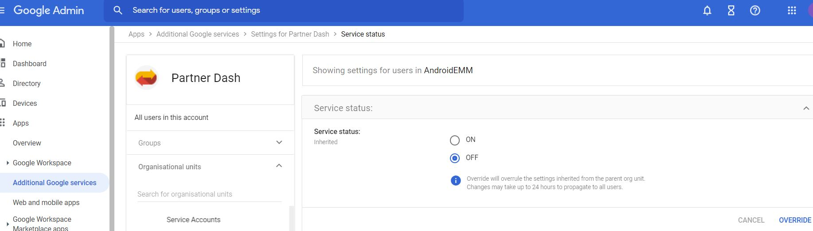

# Android Zero Touch
This function is used to enlist devices within the company ecosystem as company owned devices. Resellers can add devices in the Android Zero Touch Portal and they can be assigned to the company owned inventory. 
## What type of devices support Zero Touch
 Ideally all the devices that are displayed at <a href="https://androidenterprisepartners.withgoogle.com/devices/?_ga=2.73242067.1550745467.1634502848-1534410955.1633339329">Android Enterprise Recommended </a> support Zero Touch functionality. It is recommended that you stick with this recommended list but you can add other non-recommended devices as well. 
<b>The official link is <a href "https://support.google.com/work/android/answer/7514005?hl=en>here </a>to get an overview of Zero touch</b> 

## Access to Zero Touch Portal
You can ask the registered resellers to give you access to the Zero touch portal and add the devices on your behalf. All official zero touch resellers are mentioned <a href="https://androidenterprisepartners.withgoogle.com/resellers/" >here </a>.

## Activating Zero touch in Google Admin Console
You have to activate the Partner Dash service in Additional Google Workspace Services. By default this service is switched off. So please switch it on to get access. 
Follow <a href= "https://support.google.com/a/answer/182442">this </a> guide to activate Partner Dash. 

## Link to Zero Touch Portal
The link to Zero Touch Portal is given <a href="https://partner.android.com/zerotouch"> here </a>.

<i>Reference URLs</i> 

| Name      | Links                                  |
| ----------- | ------------------------------------ |
| Link 1      | [Android Enterprise Recommended Devices List](https://androidenterprisepartners.withgoogle.com/devices/?_ga=2.73242067.1550745467.1634502848-1534410955.1633339329)  |
| Link 2      | [Overview of Zero Touch Portal](https://support.google.com/work/android/answer/7514005?hl=en) |
| Link 3      | [Partner Dash](https://support.google.com/a/answer/182442) |
| Link 4      | [Zero Touch Resellers](https://partner.android.com/zerotouch)