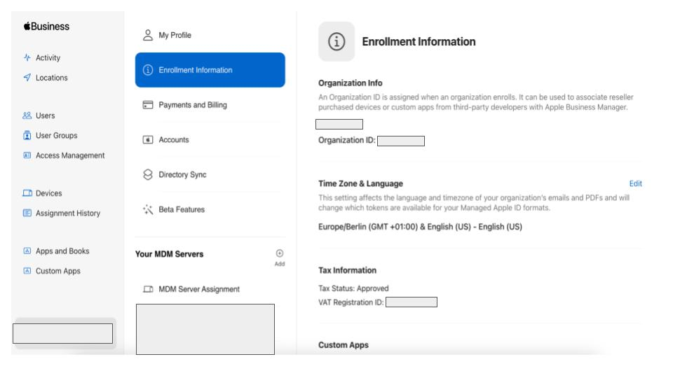

# Notes

#### Issue/ Task: How to find Organization ID 
Go to <a href="https://business.apple.com/">Apple Business Manager</a>. Then click on the lower left corner of the menu, select your username and then select __Preferences__. Or just follow the link. <a href="https://business.apple.com/#/main/preferences/enrollmentinfo">Enrollment Info link</a>. Snapshot is also attached. 

