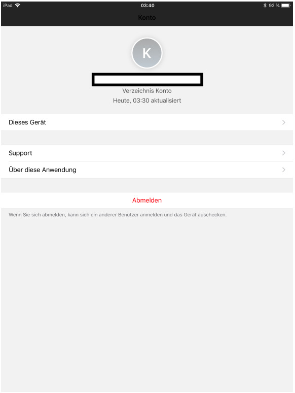

#### How to - Multi-Use Case - Configuring iOS based devices

There are certain use cases where one device has to be associated with multiple users. Usually the
enrolled device is only associated with one particular user. In order to fulfill that purpose the multi-use device has to be configured in a peculiar manner. In the multi-user configuration the user can have the ability to log in and out of the agent. 

#### Prerequisites
1) The agent have to be installed on the iOS based devices. Without the agent this configuration will not
work. 
2) The Zero Touch enrollment for this purpose cannot be used. The workaround in this case is the
enrollment though Zero touch. And then removing the device from the management and enrolling it again
through the Intelligent hub enrollment.

#### Steps
1) **Assigning an administrator as the Staging User:**
Not every user can stage the device like that. At present only the admins have the right to do that. All administrators have "no staging" enabled by default. So it has to be enable from the edit settings as the first step. 

2) **Enroll the device**
Enroll the device like a normal procedure

3) **Remove the profile**
Removing the profile from the platform. In order to remove the profile simply enterprise wipe the iOS
based device. 

4) **Stage the device**
Removing the profile from the platform. In order to remove the profile simply enterprise wipe the iOS
based device. After the Administrator will login then the following step will show in. This step tells the admin to stage the device for single or multi-user case. 

When the installation is done, then the following screen with appear. Just add the Group ID that is
provided to you, along with the username and password. Your username profile and apps will be
populated on the device.
 

5) **Completion and handover**
After the staging you can log out from the menu. Note that the sign out option is not available in single user use-case and also when the user enrolls the phone themselves. 

> Note
1: Upon Login in the hub the user profile and other apps are pushed to the device. The profile
will be removed when the user logs out of the device.
2: With the single use case the user cannot log out and enterprise wipe will remove the profile
from the device. 

